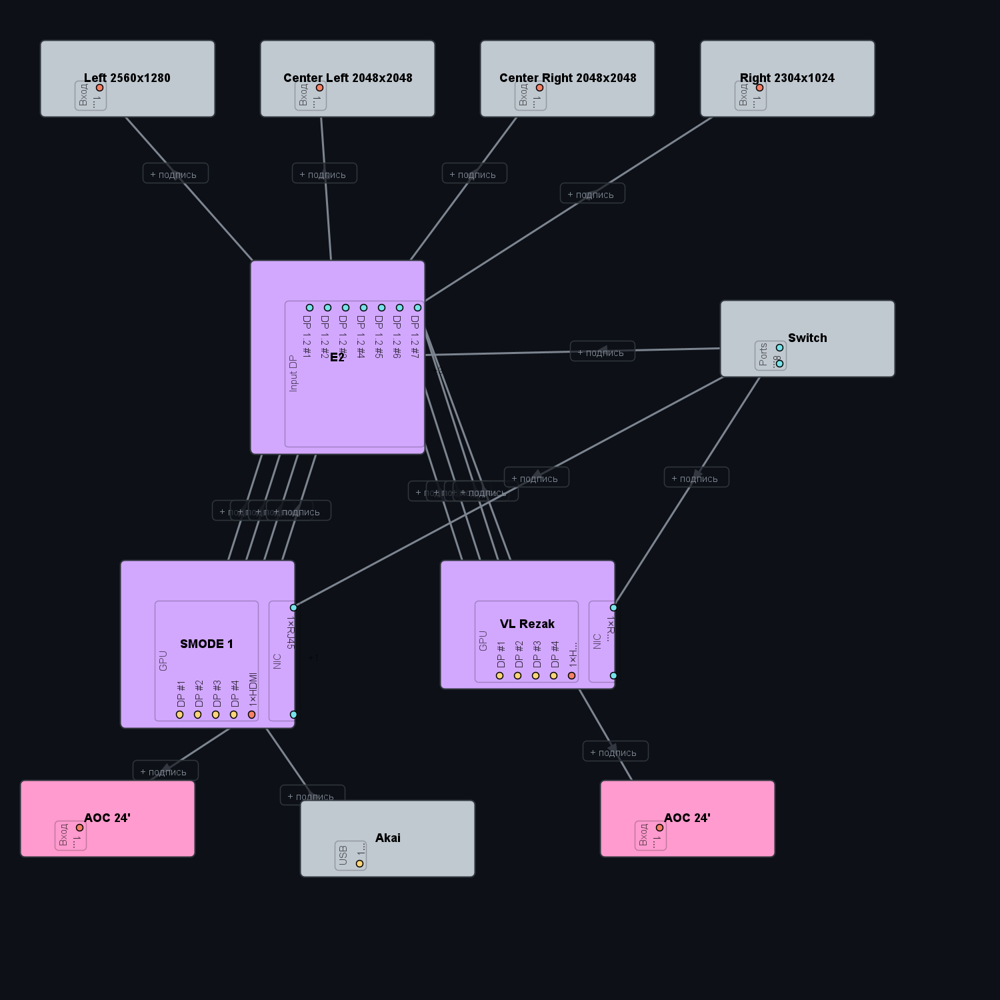
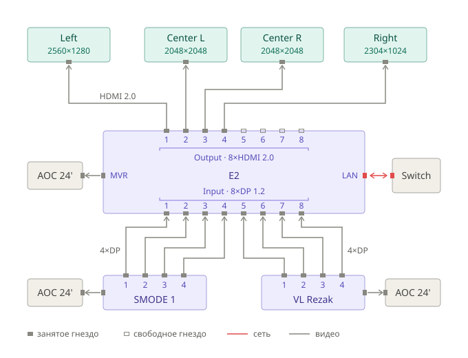
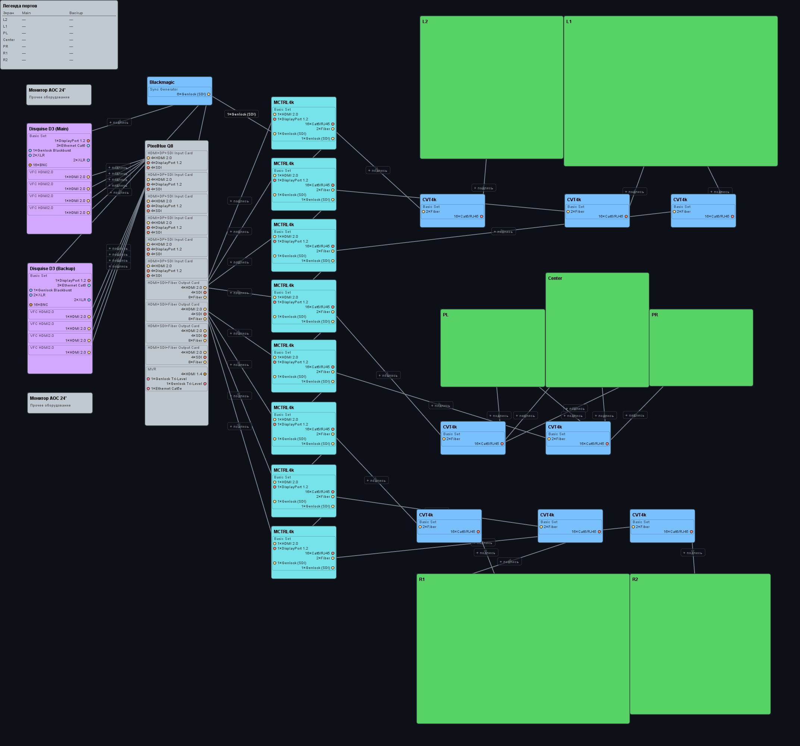
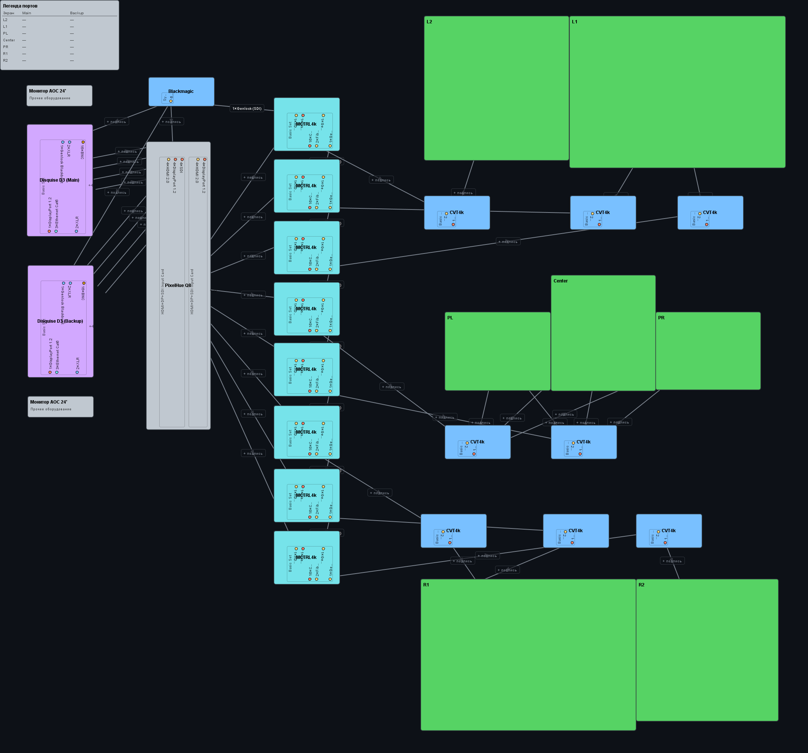
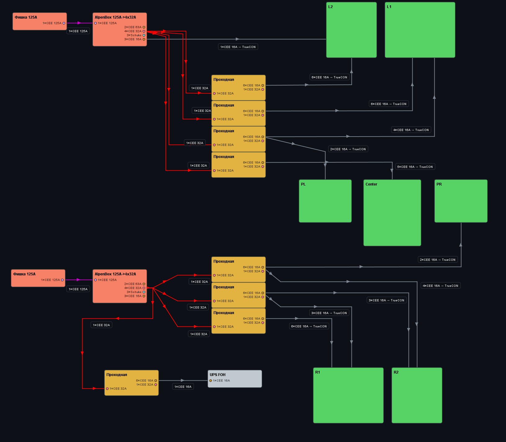
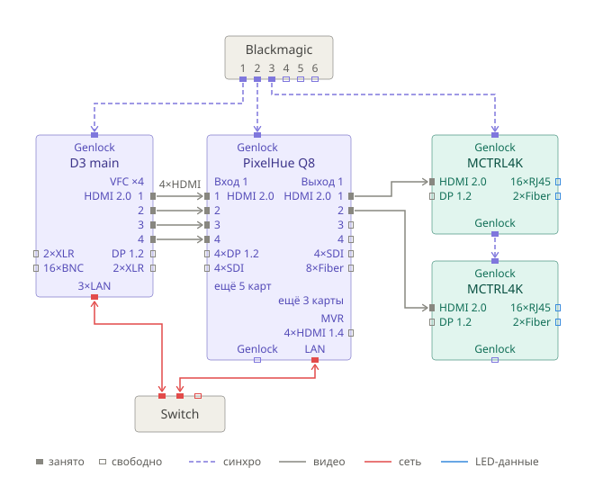
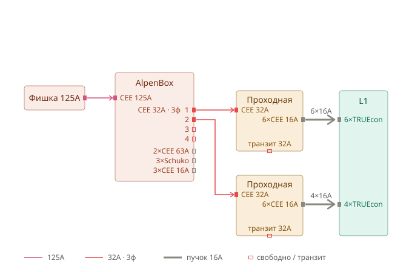

# Переработка гнёзд и связей общей схемы — запись обсуждения

| | |
|---|---|
| Дата | 2026-09-15 — 2026-09-16 |
| Участники | пользователь (SergioPimonno) и Claude (Claude Code, модель Opus 5) |
| Ветка | `claude/schema-ports-rework` от `master` (`5fad735`), рабочая копия `.claude/worktrees/schema-ports-rework`; **код ещё не менялся** |
| Статус | решения приняты, план для агентов — [`PLAN.md`](PLAN.md); реализация не начата |
| Картинки | `img/` рядом с этим файлом: текущие рендеры (`*-current-*.png`) и макеты (`mockup-*.svg`) |
| HTML-версия | опубликованная страница Claude Artifacts — ссылка в разделе «Как показать» ниже |

## Как показать это обсуждение (для Claude и людей)

- Если просят «покажи обсуждение переработки гнёзд / вертикальных гнёзд / связей общей схемы» —
  это этот файл. Покажи разделы «Итог», «Уточнения после плана» и «Решения пользователя»,
  картинки из `img/` открывай по запросу. План реализации для агентов — `PLAN.md` рядом.
- HTML-версия с теми же макетами: https://claude.ai/artifact/QrgpXCjqGpTp5QtsjEameh (приватная; владелец
  может поделиться ссылкой). Если ссылка не открывается — полная информация есть в этом файле.
- Текст реплик пользователя приведён дословно. Ответы Claude — полностью, без служебных
  вызовов инструментов (их суть кратко описана в «что сделал Claude»).
- Это запись обсуждения, **не инструкция к немедленному выполнению**: реализация идёт по
  `PLAN.md`, по поручению координатора и с разрешения пользователя на коммиты (Золотое
  правило 1 в `CLAUDE.md`).

## Итог в пяти пунктах

1. Текущий режим «гнёзда у верхнего/нижнего края блока» признан неудачным: гнёзда внутри блока,
   повёрнутый текст, жёсткое «вход сверху / выход снизу», автоподгон только по высоте, прямые
   диагональные линии.
2. Ориентир — yEd (на нём строились старые схемы): блоки с гнёздами **на рамке**, связи под
   90°, режим «ортогональные связи», перетрассировка по команде.
3. Блок = стороны → отсеки карт → группы разъёмов → гнёзда. Сторона группы определяется **ролью
   интерфейса** (видео/LED-данные/синхро/сеть/аудио; в питании ввод/отходящие/транзит) и
   ориентацией блока; группы сворачиваются, «только задействованные» прячет пустые карты.
4. Роль «сеть» — смысловое поле: на её основе потом автоматически собираются сети в сетевом
   менеджере. Свитчи — блоки из библиотеки сетевого оборудования.
5. Всё сказанное относится и к сигналу, и к питанию. Сохраняются: пользовательские цвета
   линий с палитрой, мостики-дуги на пересечениях. Печатный стиль — пресет оформления в
   «Предпочтениях» на том же рендере схемы.

---

## Реплика 1 — пользователь

> мне не нравится текущая реализация режима вертикальных гнезд. это не удобно, не красиво.
> Собери в сети примеры подобных блок-схем с похожей реализацией, подумай сам, предложи план
> переработки. в качестве примера прикрепляю пару схем старых проектов, чтобы у тебя был пример
> к чем стремиться

Вложения (3 изображения старых схем из yEd; в репозиторий не сохранены, описание):

- **Питание:** «125A потолок» → «AlpenBox 125A>8xSocapex» → шесть «Socapex>6x16A» → общая шина
  «Ring»; «125A под блитчером» → «AlpenBox 125A>4x32A» → «32A>6x16A» → экраны (Left/Right/
  Center/Circle) с подписями вида «6x16A>TRUE»; серая заметка «Крысы нужны…».
- **Сигнал с картами пикселей:** карты секций экрана с цепочками кабинетов, CVT10/CVT4k по
  оптике (Fiber 1–4), VX1000, H2, SMODE, Streamdeck, Aruba Switch — сеть красными линиями.
- **Сигнал E2:** SMODE 1 и VL Rezak по 4xDP в E2, 8xHDMI2.0 на четыре экрана, Switch/Admin DM
  красными линиями, мониторы AOC, суфлёр по SDI.
- Общий стиль: жёлтые блоки, линии под 90°, подписи на линиях, цвет линии по типу сигнала.

### Что сделал Claude

- Прочитал реализацию: `SchemaCanvasPanel` (`computeSocketRects`, `drawConnectorRows`,
  `drawVerticalLabel*`, `endpointsFor`, `paint`), `AppModel.autoFitNodeToPorts`, настройки
  `UserProfile.signal/powerConnectorsVertical`.
- Отрисовал демо-схему (E2, SMODE, VL Rezak, 4 экрана) текущим кодом через
  `SchemaCanvasPanel.renderImage` → `img/demo-current-vertical.png`.
- Собрал примеры: ConnectCAD, draw.io, ELK, Simulink, yEd/yFiles, libavoid, GoJS, практика
  AV-схем. Сделал макет `img/mockup-1-demo.svg`.

### Ответ Claude

**Что не так в текущем режиме**

1. **Гнёзда стоят внутри блока, а не на рамке.** Точка отступает от края на 6 px. Колонки ещё и
   начинаются в 38 px от левого края: это отступ под заголовок из горизонтального режима, по
   ошибке применённый к оси X ([SchemaCanvasPanel.java:2783](../../src/main/java/com/vjstb/ledscheme/ui/SchemaCanvasPanel.java)).
   Линии уходят под заливку блока, и не видно, в какое гнездо они приходят.
2. **Направление жёстко задано одной галочкой: вход сверху, выход снизу.** На схемах
   пользователя сигнал идёт снизу вверх, питание сверху вниз и справа налево — линии проходят
   сквозь блоки.
3. **Текст повёрнут на 90°** у каждого гнезда и у имени карты; подписи обрезаются до «1…», «1×R…».
4. **Название блока в центре наезжает на подписи гнёзд.**
5. **Автоподгон размера растит только высоту** (`AppModel.autoFitNodeToPorts`), а в
   вертикальном режиме нужна ширина: у E2 видно 7 из 8 DP-входов, HDMI-выходы не поместились.
   Отдельные гнёзда в режиме «каждый разъём отдельно» не учитываются и в горизонтальном режиме;
   константы продублированы и разошлись (`CARD_HEADER_H` 14 в `AppModel` и 13 на холсте).
6. **Линии прямые, по диагонали**; под 90° только вручную точками излома.
7. **Чипы «+ подпись» попадают в экспорт** (`renderImage` вызывает тот же `paint`).

**Что показали примеры**

- ConnectCAD: входы слева, выходы справа, верх блока — под название.
- draw.io: линии предсказуемы, только если точки подключения на периметре фигуры.
- ELK: сторона порта N/S/E/W, фиксированная сторона и порядок, направление потока, размещение
  подписей портов — готовая модель.
- Simulink: поворот и отражение у каждого блока (Ctrl+R).
- yEd/yFiles: ортогональный трассировщик и трассировка «шиной».
- libavoid: ортогональная трассировка от пинов с направлением и раздвигание общих участков.
- GoJS Dynamic Ports: порты на всех четырёх сторонах.
- Практика AV: тип сигнала подписью на линии и цветом; сеть отдельным цветом.

**Концепция:** блоки как на схемах пользователя, гнёзда по модели yEd/ELK — ориентация у
каждого блока, пины на рамке, текст горизонтальный, «вход/выход» (сеть) сбоку, связи под 90°,
подписи простым текстом.

**План (первая версия)** — вынести геометрию из `SchemaCanvasPanel` в класс без Swing; новый
вид блока; ортогональные связи; по желанию печатный стиль экспорта. Уточнён во второй реплике.

---

## Реплика 2 — пользователь

> проработай вариант когда у каждого блока несколько разных групп разных интерфейсов, сейчас
> твой пример очень однобок (в Е2 не только 8 hdmi out). можешь в качестве примера взять мой
> проект бармицва, там уже собрал общую схему сигнала.
> Твое исследование одобряю. замечу что ранее схемы строили именно в yedграфе, и на него я
> ориентировался когда разрабатывался концепт блок-схем.
> жду план, заодно сделай сразу отдельную ветку ввв гите под эту переработку. помни что для
> питания эта праввка тоже актуальна

Дополнение пользователя (отправлено следом):

> отдельно отмечу что идея выделять сеть отдельно мне очень нравится, поскольку в плане фич
> есть автоматическое формирование сетей в сетевом менеджере на базе общей схемы

### Что сделал Claude

- Выгрузил (только чтение) общую схему проекта «Бармицва», сцена «Основной зал»: 30 сигнальных
  и 20 силовых блоков, 69 связей.
- Отрисовал её текущим кодом с копии workspace: `img/barmitzvah-signal-current-horizontal.png`,
  `img/barmitzvah-signal-current-vertical.png`, `img/barmitzvah-power-current-horizontal.png`.
  Экраны на этих картинках пустые, потому что временный рендер не подгружал библиотеку
  кабинетов; это не баг приложения.
- Сверился со справкой yEd по ортогональному редактированию и портам.
- Создал ветку `claude/schema-ports-rework` от `master` **без переключения** (в основной папке
  на `master` лежат незакоммиченные правки другой задачи — `ClientBackupClient`/
  `ClientBackupSync`, `AppModel` и др.).
- Сделал макеты `img/mockup-2-signal.svg` и `img/mockup-3-power.svg`.

Состав блоков «Бармицвы» (пригодится для синтетического тестового набора; сам проект в
публичный репозиторий не кладём):

| Блок | Комплектация |
|---|---|
| PixelHue Q8 | 6 карт входа (4×HDMI 2.0 + 4×DP 1.2 + 4×SDI IN), 4 карты выхода (4×HDMI 2.0 + 4×SDI + 8×Fiber OUT), MVR (4×HDMI 1.4 OUT, Genlock Tri-Level IN/OUT, Ethernet Cat5e IN) |
| Disguise D3 ×2 | Basic Set (DP OUT, 3×Ethernet Cat6 OUT, Genlock Blackburst IN, 2×XLR IN, 2×XLR OUT, 16×BNC IN) + 4 карты VFC (1×HDMI 2.0 OUT) |
| MCTRL4K ×8 | HDMI 2.0 IN, DP 1.2 IN, 16×Cat6/RJ45 OUT, 2×Fiber OUT, Genlock IN, Genlock OUT; генлок-петля между ними |
| CVT4K ×8 | 2×Fiber IN, 16×Cat6/RJ45 OUT |
| Blackmagic | Sync Generator: 6×Genlock OUT |
| Экраны ×7 | «Вводы сигнала»: 2–10×Ethernet IN (авто) |
| AlpenBox ×2 | CEE 125A IN; 2×CEE 63A, 4×CEE 32A, 3×Schuko, 3×CEE 16A OUT |
| Проходная ×8 | CEE 32A IN, CEE 32A OUT, 6×CEE 16A OUT |
| Экраны (питание) ×7 | 2–10×TRUEcon IN (авто) |

### Ответ Claude

**Что показала «Бармицва»**

- Горизонтальный режим: все 8 выходов Q8 на MCTRL сходятся в одну точку группы
  «4×HDMI 2.0»; генлок-петля между восемью MCTRL, стоящими столбиком, идёт диагоналями поперёк
  блоков.
- Питание: пользователь уже вручную развёл линии под 90°, как в yEd, но 4 линии 32A выходят
  «звездой» из одной точки.
- Вертикальный режим: у Q8 видно 2 карты из 11, подписи обрезаны до «16×C…», «2xFib…».
- Роль гнезда нельзя вывести из названия разъёма: «Cat6/RJ45» и «Fiber» на MCTRL4K/CVT4K —
  данные для LED, а «Ethernet Cat6» на D3 и «Ethernet Cat5e» на MVR Q8 — IP-сеть. Сеть у D3
  заведена как OUT, хотя по сути двусторонняя.

**Как устроен блок с несколькими группами.** Иерархия: сторона → карта (отсек) → группа
(`CardPort`) → гнёзда.

1. Роль интерфейса определяет сторону; сторона поворачивается вместе с ориентацией блока
   (→ ↑ ↓ ←). Таблица по умолчанию для потока «слева направо»:

   | Роль | Вход | Выход | Пример из «Бармицвы» |
   |---|---|---|---|
   | Видео / LED-данные / аудио | слева | справа | HDMI, DP, SDI, Fiber, RJ45 на MCTRL |
   | Синхро | сверху | снизу | Genlock: столбик MCTRL сцепляется короткими вертикальными линиями |
   | Сеть / управление | снизу (двусторонние) | снизу | LAN у D3 и MVR Q8 |
   | Питание: ввод / отходящие | слева | справа | CEE 125A / 4×CEE 32A |
   | Питание: транзит | — | снизу | выход 32A у «Проходной» |

   Любую группу можно вручную перенести на другую сторону или поменять порядок.
2. Отсеки карт: шапка «Вход 1», «Выход 1», MVR; одинаковые карты подряд схлопываются
   («VFC ×4»); у блока с одной картой «Basic Set» шапка не рисуется.
3. Плотность (Q8 — 140+ гнёзд): группа свёрнута (одно гнездо «4×DP 1.2») или развёрнута
   (номера 1…N, название один раз); «авто» разворачивает группу при первой подключённой линии;
   переключатель «только задействованные» сворачивает пустые карты в строку «ещё 5 карт»,
   проверка ёмкости при этом учитывает все гнёзда.
4. Текст только горизонтальный: номера гнёзд плюс одна подпись группы.
5. Экраны: для гнёзд-кабинетов внутри миниатюры — гнездо на рамке напротив кабинета и тонкая
   выноска внутрь.

**Связи — поведение yEd**

- Режим «Ортогональные связи»: при перемещении блока ближайший излом сдвигается, линия
  остаётся под 90°; перетаскивание отрезка двигает весь отрезок.
- Команда «Перетрассировать выделенные / все»: выход перпендикулярно рамке, обход блоков,
  параллельные линии по отдельным «полосам».
- Существующие ручные изломы сохраняются; перетрассировка только по команде.
- Пучок: несколько линий в одно свёрнутое гнездо — одна толстая линия с подписью «6×16A».
- Цвет линии по роли (видео / LED / синхро / сеть), в питании — по номиналу; ручной цвет важнее.
- Подписи простым текстом; без заданной подписи — тип разъёма; чип «+ подпись» только при
  наведении и не в экспорте.

**Питание отдельно:** карт нет — один отсек; в подписи группы фазы и автомат («CEE 32A · 3ф»,
«C16»); роль «транзит» (см. уточнение ниже); значок перегрузки в шапке, по желанию подсветка
перегруженной группы.

**Сеть → сетевой менеджер:** роль «сеть» — смысловое поле. Устройства — блоки с сетевыми
гнёздами, связи — линии между сетевыми гнёздами (свитчи — см. уточнение ниже). Сетевые гнёзда
двусторонние, «защита от дурака» не должна запрещать OUT↔OUT для D3. Сама сборка сетей —
отдельная фича.

**Где хранятся данные**

- Только клиент (`SchemaNode` — клиентский класс; неизвестные поля при чтении игнорируются):
  `SchemaNode.orientation`; раскладка групп (сторона, порядок, свёрнута); «только
  задействованные»; `SchemaEdge.routeMode` («авто под 90° / ручной / прямой»).
- `ledscheme-model` (Золотое правило 3, правка админки): `InterfaceRole`, роль по умолчанию у
  `InterfaceType`, необязательная роль у `CardPort` (пресет MCTRL4K один раз помечает RJ45 как
  LED-данные). Пока поля нет — угадывание по названию и типу блока.
- Сервер, скорее всего, хранит элементы библиотеки как JSON целиком — проверить.

**Этапы** (в ветке; каждый — тесты и пересборка тестового билда, коммиты только с разрешения):

0. Эталонный рендер: JUnit-генератор картинок под флагом (как `ScenarioShotSpike`) на
   синтетической копии структуры «Бармицвы»; сравнение «до/после» на каждом этапе.
1. Геометрия и роли (только клиент): `NodePortLayout` и определитель ролей без Swing — общая
   геометрия для отрисовки, клика, привязки линий и автоподгона; ориентация блока; миграция
   старой галочки.
2. Новый вид блока: гнёзда на рамке, отсеки, свёртка, «только задействованные», выноски у
   экранов; меню «Ориентация» (Ctrl+R) и меню группы; сигнал и питание одновременно.
3. Связи: трассировщик без Swing, режим «ортогональные связи», «перетрассировать», полосы,
   пучки, стрелка у приёмника, чистые подписи.
4. Роли в библиотеке: `ledscheme-model` + админка, цвета линий по ролям, легенда линий,
   заготовка «сеть из схемы».
5. По желанию: печатный стиль экспорта, блок-«шина» (Ring). Уточнено ниже: печатный стиль —
   пресет оформления в «Предпочтениях» поверх имеющегося рендера.

---

## Уточнения после плана (реплики пользователя и ответы Claude)

### Цвета линий

> необходимо сохранить функционал палитры и выбора пользовательских цветов для отдельных линий

Сохраняется полностью: `SchemaEdge.color`, пункт «Цвет линии…» с палитрой и «Сбросить цвет
линии» остаются. Цвет по роли (или по номиналу в питании) — только значение по умолчанию для
линий, у которых свой цвет не выбран. «Сбросить» возвращает к цвету роли.

### Как определяется роль «транзит»

> не понял каким образом: задается в библиотеке, или менеджер схемы это определяет...как?

Три источника, по старшинству:

1. **Ручная правка в проекте** — ПКМ по группе → «Роль…». Хранится в блоке схемы (клиент),
   действует только в этом проекте.
2. **Библиотека** — роль у разъёма в пресете оборудования (`EquipmentPreset.powerConnectors` /
   `cards`, поле роли у `CardPort`, редактируется в админке). При добавлении блока из пресета
   копируется вместе с разъёмами, как сейчас копируется комплектация.
3. **Автоугадывание схемой** — только если 1 и 2 пусты. Правило: в пределах одной карты (у
   питания — всего списка разъёмов блока) есть ровно **один** вход и ровно **один** выход
   одного и того же типа разъёма → этот выход считается транзитом.
   - «Проходная»: CEE 32A — 1 вход и 1 выход → транзит; 6×CEE 16A — входа 16A нет → отходящие.
   - MCTRL4K: Genlock 1 вход + 1 выход → транзит (петля).
   - D3: XLR 2 входа + 2 выхода → не транзит (не по одному).
   - Q8: HDMI вход и выход на разных картах → не транзит.
   - Может ошибиться (например, конвертер HDMI→HDMI с одним входом и одним выходом), поэтому
     показывается как «транзит (авто)» и правится вручную. Оставлять ли угадывание вообще —
     открытое решение 2.

### Свитчи

> свитчи - отдельные блоки из библиотеки сетевого оборудования. это важно, поскольку например
> у серверов Disquise D3 по 4 сетевых порта

Принято, прежнее «блок с тремя и более сетевыми гнёздами» неверно. Свитч/роутер определяется
библиотекой сетевого оборудования (`NetworkDeviceType`, категория `NetworkDeviceCategory.SWITCH`
и т.д., число портов `ethernetPortCount`/`opticalPortCount`), а не числом гнёзд. В план
добавляется: блоки из библиотеки сетевого оборудования можно ставить на общую схему сигнала;
их гнёзда создаются из числа портов типа (роль «сеть», двусторонние). D3 с 4 сетевыми портами
остаётся конечным устройством. Для будущей автосборки сетей: устройства — блоки с
подключёнными сетевыми гнёздами, коммутаторы — блоки, связанные с `NetworkDeviceType`; уже
существующая связь `NetworkDevicePlacement.linkedSchemaNodeId` переиспользуется.

### Мостики-дуги

> хорошо. но сохрани механизм дуг, он мне нравится

Сохраняется: `WireHopGeometry` и настройка «Мостики на пересечениях» (дуга / усечённая дуга /
без обходов) работают с любой ломаной, ортогональные маршруты их не отменяют. В тесты этапа 3
добавить проверку, что дуги строятся на ортогональных маршрутах.

### Печатный стиль

> сделай такой печатный стиль как пресет визуала в предпочтениях, в основе оставляем имеющийся
> механизм рендера схемы

Принято для этапа 5: печатный стиль (белый фон, жёлтые блоки, тёмные линии, как в yEd) — это
**пресет оформления в «Предпочтениях»**, а не отдельный рендерер. Рисует тот же
`SchemaCanvasPanel.paint` / `renderImage`; меняется только набор цветов и толщин: цвета фона,
блоков по типу, рамок, текста, линий по ролям. Для этого цвета, которые сейчас зашиты в холст
(`Palette.BG`, `nodeColor(...)`, `CONNECTOR_PALETTE` и т.п.), выносятся в один объект стиля
схемы; «Тёмный» (как сейчас) и «Печатный» — два пресета этого объекта. Пользовательские цвета
отдельных линий по-прежнему важнее пресета.

### Ориентация блока при ручной раскладке гнёзд (после реализации T3.3, 2026-09-16)

> поскольку назначенная пользователем ориентация портов овверрайдит автоматическую, втч базовую
> ориентацию блока (меняю ориентацию блока, поставленные вручную порты остаются на месте), то как
> будто от ориентации блока не остаётся смысла - каждый порт можно выставить отдельно. Пока что
> оставь как есть, но сделай пометку что возможно ориентацию блоков будем убирать.

Замечание верное: `PortPlacement.side` (D3) намеренно НЕ поворачивается при смене
`NodeOrientation` (§2.2 PLAN.md — "пользователь поставил группу руками — она остаётся там"), а
любую группу можно перетащить на любую сторону. Как только у блока переопределены стороны всех
групп вручную, `NodeOrientation` перестаёт на что-либо влиять — она нужна только как ПРАВИЛО
раскладки по умолчанию для ещё не тронутых групп (таблица §2.2). Решение по итогам этого
замечания: пока НЕ пересматривать — `NodeOrientation` остаётся как есть (в т.ч. как источник
поворота для групп без ручного оверрайда и как поле `signalDefaultOrientation`/
`powerDefaultOrientation` в настройках, §2.8). Открытый вопрос на будущее: возможно, понятие
"ориентация блока" стоит убрать целиком, оставив только ручную/дефолтную раскладку по ролям без
общего поворота — решать после того, как будет видно на реальных схемах, насколько часто
пользователь трогает стороны вручную. Не реализовывать без нового явного запроса.

---

## Решения пользователя

Вопросы Claude и ответы пользователя (дословно):

1. *Подходит ли таблица сторон по ролям? Главное: синхро сверху-вниз, сеть снизу, транзит
   питания снизу.*
   > да, вполне. но синхро сделай перетаскиваемым, часто этот порт удобно ставить сбоку.

   → Таблица принята; любая группа, включая синхро, перетаскивается мышью на любую сторону.
2. *Роль хранить в библиотеке (`ledscheme-model` + админка) или только угадывать по названию и
   править в проекте?*
   > в библиотеке, нужно переделать пресет и интерфейс чтобы было удобно эти роли назначать

   → Роли в библиотеке; редакторы пресетов в клиенте и админке переделываются (PLAN.md, этап 5).
   Угадывание остаётся запасным вариантом для старых данных.
3. *Незанятые гнёзда по умолчанию показывать свёрнутыми группами, а «только задействованные»
   включать на блоке?*
   > да, незанятые сворачиваются, задействованные включаются

   → Незадействованная группа свёрнута, задействованная развёрнута автоматически.
4. *Старые схемы оставить как есть, перетрассировку — только по кнопке?*
   > да
5. *Работаем в отдельной папке-копии на ветке `claude/schema-ports-rework`?*
   > да. подготовь план для агентов, заниматься реализацией будут агенты sonnet5

   → Создана рабочая копия `.claude/worktrees/schema-ports-rework`; план для агентов —
   [`PLAN.md`](PLAN.md).

Итоговая просьба пользователя:

> собирай все уточнения и правки, жду план

## Реплика 3 — пользователь (сохранение)

> сохрани этот диалог в каком-нибудь формате, чтобы другой пользователь мог сказать клоду
> показать его и он смог это сделать

→ Сохранено: этот файл + картинки в `img/` + `PLAN.md` (в ветке `claude/schema-ports-rework`),
HTML-версия опубликована как приватная страница Claude Artifacts (ссылка — в начале файла).

## Реплика 4 — пользователь (правка подхода, 2026-09-18)

Во время реализации этапа 5 (роли в библиотеке и редакторах), уже после того как этапы 1–4
(модель, раскладка, новый вид блока, ортогональные связи) фактически заменили старый рендер
`SchemaCanvasPanel` новым без сохранения старого пути:

> продолжай по плану. Сразу вношу корректировку в наш подход. продумай момент что обновленная
> система рисования блок схем должна быть альтернативным режимом, переключаемым в
> предпочтениях, некоторым людям нравится старый способ рисования схем и их вид

Уточнено через два вопроса координатора пользователю:

1. *Что именно возвращает переключатель — полностью старый рендер (раскладка, трассировка,
   без ориентации/ролей/орто-связей/перетаскивания групп/сетевых блоков) или только цвета
   поверх нового движка раскладки, или набор отдельных переключателей по фиче?*
   > Полностью старый рендер.
2. *Уровень применения — глобально в профиле пользователя или по проекту/сцене?*
   > Глобально в профиле пользователя.

→ Решение **D16** (добавлено в `PLAN.md` §1) и новая задача **T5.5** (`PLAN.md`, «Этап 5.5»):
`UserProfile.schemaRenderMode` (`MODERN` default / `CLASSIC`), переключатель в «Предпочтениях»
рядом с «Оформление схемы» (D12); `CLASSIC` реинтегрирует дорефакторинговые приватные методы
`SchemaCanvasPanel` (отрисовка и хит-тестинг) один в один, полученные из `master`
(на момент задачи ветка `claude/schema-ports-rework` не имеет ни одного коммита — весь diff
этапов 1–5 лежит поверх `master` без изменений, коммит `5fad735`, так что старый файл целиком
доступен как `git show master:src/main/java/com/vjstb/ledscheme/ui/SchemaCanvasPanel.java`).
По умолчанию — `MODERN` (переключатель — дополнительная свобода для тех, кому не нравится
новый вид; поведение по умолчанию не меняется, т.к. текущий код и так уже только MODERN).

## Реплика 5 — пользователь (T6.2 снят, 2026-09-18)

После вопроса координатора про блок-«шину» (Ring, T6.2):

> Если сейчас реализовано сливание нескольких линий в одну шину (что я не увидел
> во время теста), то тогда это уже не актуально

Проверка показала: `service.schemalayout.EdgeBundles` (T4.3 — точка слияния и
подпись "×N" для нескольких связей в одно свёрнутое гнездо, D8) была реализована и
покрыта тестами ещё на этапе 4, но `SchemaCanvasPanel` (T4.4) ни разу её не
вызывала — геометрия существовала только в тестах, отрисовка никогда её не
использовала. Пользователь был прав: не увидел, потому что это ДЕЙСТВИТЕЛЬНО не
рисовалось, а не потому что не заметил.

→ Пробел закрыт (не T6.2, а доводка T4.3/T4.4): `SchemaCanvasPanel.
drawEdgeBundleMarkers`/`bundleCount` рисуют короткий ствол + подпись количества
для каждого гнезда, куда сходится 2+ связей (только если группа СВЁРНУТА —
развёрнутая группа даёт каждой связи свой отдельный пронумерованный пин, сливать
нечего). Проверено рендером: 3 силовые линии от разных источников в одно
принудительно свёрнутое гнездо «3×CEE 16A» дают ровно тот эффект, что описан в
исходном референсе («шесть Socapex>6x16A → общая шина Ring», реплика 1) — общий
короткий отрезок и подпись «×3» в точке слияния. Отдельный тип узла-«Ring» не
нужен, T6.2 снят с плана.

## Источники

- [yEd: Orthogonal Edges](https://yed.yworks.com/support/manual/orthogonal_edges.html)
- [yEd: Edit Mode (ports, port candidates)](https://yed.yworks.com/support/manual/edit_mode.html)
- [yEd Q&A: evenly space edge ports across a node side](https://yed.yworks.com/support/qa/14459/how-to-evenly-space-edge-ports-across-the-side-the-node-theyre)
- [yEd: Orthogonal Bus-style Edge Router](https://yed.yworks.com/support/manual/layout/router_orthogonal_bus.html)
- [yFiles: Orthogonal Edge Editing](https://docs.yworks.com/yfiles-html/dguide/customizing_interaction/customizing_interaction_orthogonal_edges.html)
- [yFiles: Port Placement](https://docs.yworks.com/yfiles-html/dguide/layout/port_placement.html)
- [yFiles: Orthogonal Edge Routing](http://docs.yworks.com/yfiles/doc/developers-guide/orthogonal_edge_router.html)
- [ConnectCAD: Concept — devices](https://app-help.vectorworks.net/2026/eng/VW2026_Guide/ConnectCAD/Concept_ConnectCAD_devices.htm)
- [ConnectCAD: Adding sockets, loops, and terminators](https://app-help.vectorworks.net/2024/eng/VW2024_Guide/ConnectCAD/Adding%20sockets_loops_and%20terminators.htm)
- [draw.io discussion #5504: connections messy](https://github.com/jgraph/drawio/discussions/5504)
- [draw.io: Customise connection points](https://www.drawio.com/docs/manual/shapes/shape-connection-points-customise/)
- [ELK: Port Constraints](https://eclipse.dev/elk/reference/options/org-eclipse-elk-portConstraints.html)
- [ELK: Port Side](https://eclipse.dev/elk/reference/options/org-eclipse-elk-port-side.html)
- [ELK: Direction](https://eclipse.dev/elk/reference/options/org-eclipse-elk-direction.html)
- [ELK: Port Label Placement](https://eclipse.dev/elk/reference/options/org-eclipse-elk-portLabels-placement.html)
- [Wybrow et al., Orthogonal Connector Routing (libavoid)](https://users.monash.edu/~mwybrow/papers/wybrow-gd-2009.pdf)
- [libavoid: ShapeConnectionPin](https://www.adaptagrams.org/documentation/classAvoid_1_1ShapeConnectionPin.html)
- [GoJS: Dynamic Ports sample](https://gojs.net/latest/samples/dynamicPorts.html)
- [Simulink: Configure Model Layout](https://www.mathworks.com/help/simulink/ug/configure-model-layout.html)
- [AV Signal Flow Diagrams guide](https://kennyavsolution.com/av-signal-flow-diagrams-guide/)
